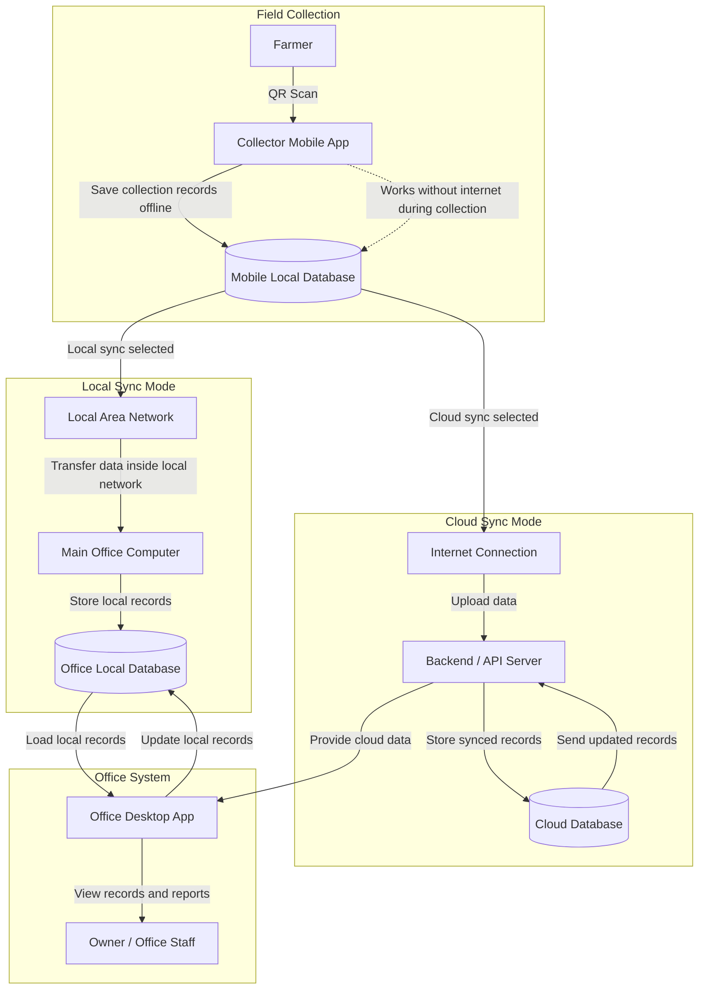
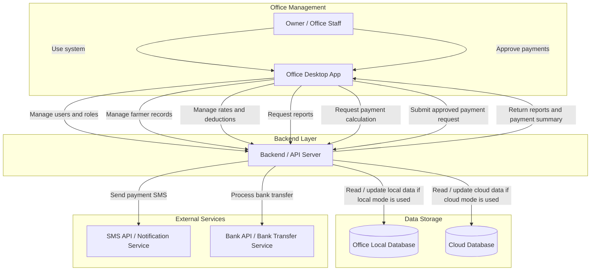

# Tea Collection & Payment System

A system design project for improving tea leaf collection, farmer record management, deduction handling, and monthly payment processing in a tea collection business.

## Project Overview

The current process depends on manual record books and an old Windows-based desktop system. Tea collectors record daily leaf weights during route collection, and office staff later enter the data manually. Monthly payments are then calculated after applying deductions such as loans, fertilizer, and tea-related deductions.

This project designs a modern system that supports offline tea collection, accurate farmer records, payment calculation, reporting, and bank transfer support.

## Main Objectives

- Reduce manual record handling
- Support offline data collection during lorry routes
- Maintain accurate farmer, route, and collection records
- Calculate monthly payments 
- Support both local sync and cloud sync
- Improve office reporting and payment preparation

## Proposed System

The proposed system includes:

- **Collector Mobile App** for tea leaf collection during routes
- **Office Desktop App** for owner and office staff
- **Mobile Local Database** for offline collection records
- **Office Local Database** for local office operation
- **Cloud Server / API** for optional cloud synchronization
- **Cloud Database** for backup and remote access
- **SMS and Bank Transfer Support** for payment communication

Users can choose between **local sync** and **cloud sync** based on operational needs.

## Key Features

- QR code scanning
- Daily tea leaf weight entry
- Route-based collection records
- Farmer profile management
- Monthly tea rate management
- Loan, fertilizer, and tea deduction handling
- Monthly payment calculation
- Receipt and report generation
- Bank transfer support 
- SMS notification support 
- Offline-first data storage
- Local and cloud synchronization

### 1. Data Synchronization Flow

### 2. Office, User Management, Payment, and External Services Flow

