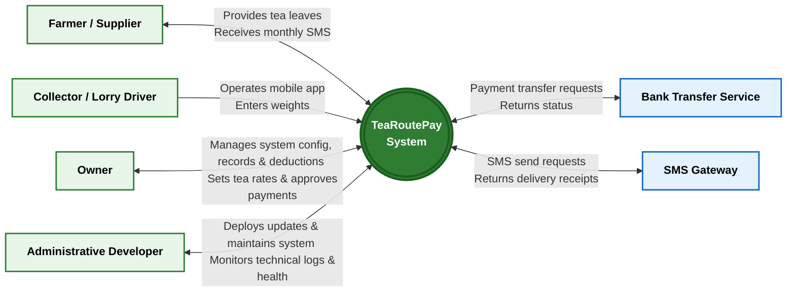

# System Context Diagram

This directory contains the System Context Diagram for the TeaRoutePay project, as defined in the system architecture and arequirements documentation.

## Diagram Overview
The context diagram provides a high-level view of the TeaRoutePay system boundary and its interactions with external actors.

### External Actors
1. **Farmer / Supplier**: Provides tea leaves and receives monthly SMS payment notifications.
2. **Collector / Lorry Driver**: Operates the mobile application during field routes to enter weights.
3. **Owner**: Acts as system administrator and office staff; manages system configurations, records, deductions, sets tea rates, approves payments, and views dashboards.
4. **Administrative Developer**: Maintains the system infrastructure, deploys updates, and monitors technical logs and health.
5. **Bank Transfer Service (External)**: Receives approved payment transfer requests and returns statuses.
6. **SMS Gateway (External)**: Receives SMS send requests and returns delivery receipts.

