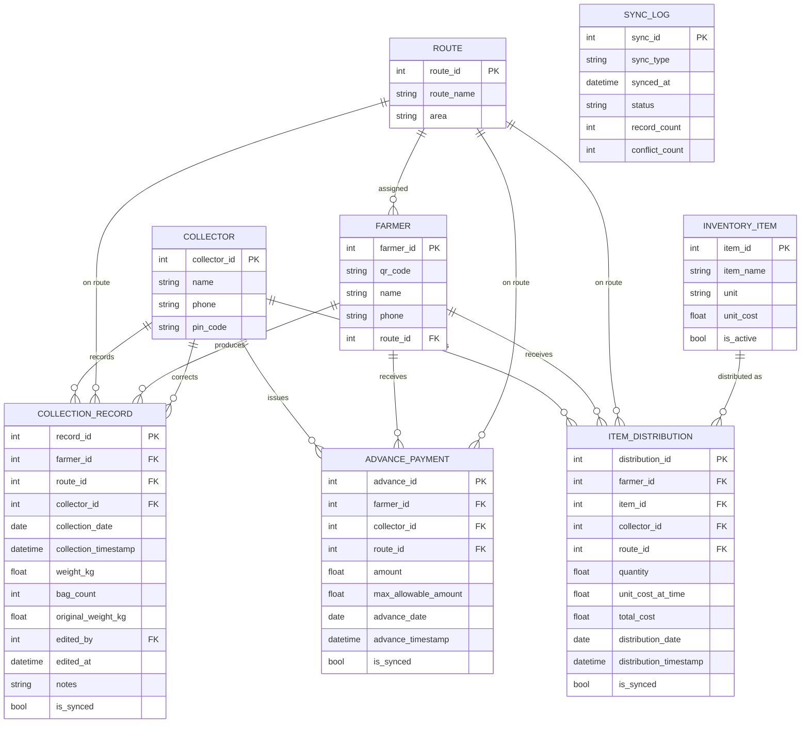
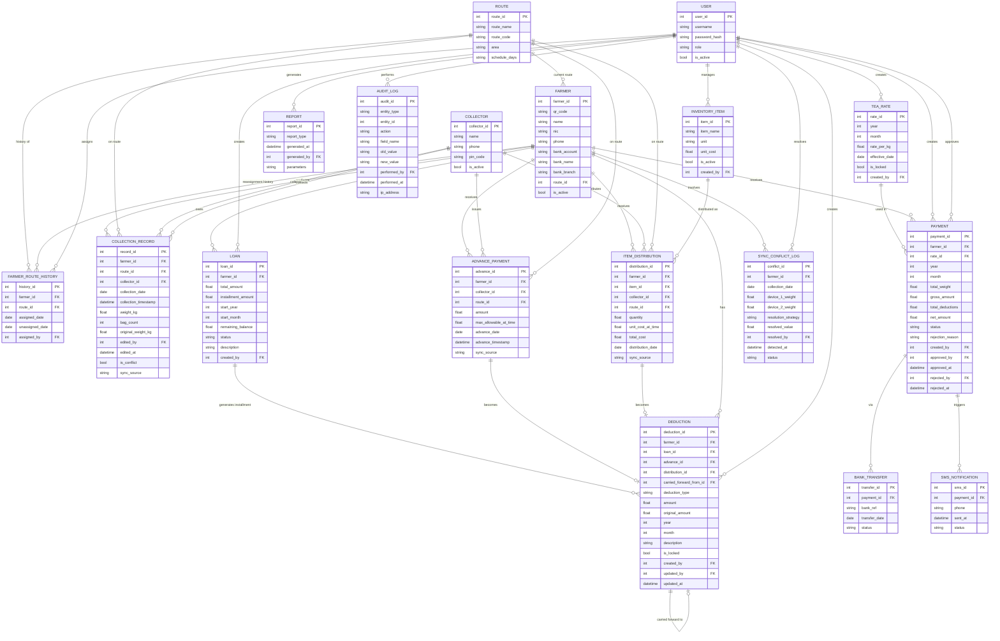

# Data Model and Entity-Relationship Diagram (ERD)

## 1. Overview
The TeaRoutePay database is designed to support a **Hybrid Local-First Architecture**. The data model enforces strict relational integrity across two core operational environments:

1. **Mobile Local Database (Collector App):** Offline-first schema for daily tea leaf collection, cash advances, and item distribution during lorry routes.
2. **Office / Cloud Database (Desktop App):** Full schema for farmer management, deductions, loan amortization, payment calculation, bank transfer/SMS notification, reporting, and compliance auditing.

This revision adds five capabilities that v1.0 did not represent at the data level:

- **Field financial transactions** — cash advances (UC-06) and item/fertilizer distribution against inventory (UC-05, UC-24) as first-class entities, instead of being folded into `COLLECTION_RECORD`.
- **Compliance auditing** — an immutable `AUDIT_LOG` for all changes to financial and configuration records (NFR-10, FR-06, FR-11, FR-42, FR-45, BR-18), separate from `SYNC_LOG`, which only tracks sync batches.
- **Loan amortization** — a `LOAN` parent entity so multi-month installment deductions can track a running balance to zero (FR-32, FR-33).
- **Route reassignment history** — `FARMER_ROUTE_HISTORY` so reassignments are retained rather than overwritten (FR-15).
- **Sync conflict logging** — a dedicated `SYNC_CONFLICT_LOG` for same-farmer/same-date weight conflicts from two devices (FR-28).

## 2. Entity-Relationship Diagrams

### 2.1 Mobile Local Database
*Offline-first schema for daily tea leaf collection, cash advances, and item distribution during lorry routes.*

### 2.2 Office / Cloud Database
*Full schema for farmer management, deductions, loan amortization, payment calculation, reporting, and auditing.*

## 3. Data Dictionary

### 3.1 Mobile Database Entities
| Entity | Description | Key Attributes & Constraints |
| :--- | :--- | :--- |
| **COLLECTOR** | Staff members collecting tea. | `pin_code` used for mobile app access. |
| **ROUTE** | Predefined paths for tea collection. | Serves as a grouping mechanism for farmers. |
| **FARMER** | The suppliers of tea leaves. | `qr_code` allows quick lookup during collection. |
| **COLLECTION_RECORD** | Individual instances of tea leaf collection. | Tracks `weight_kg` and `bag_count`. `is_synced` prevents duplicate uploads. `original_weight_kg`/`edited_by`/`edited_at` preserve the pre-correction value (FR-21). |
| **ADVANCE_PAYMENT** | Cash advances issued to a farmer in the field (UC-06). | `max_allowable_amount` records the cap computed from accumulated leaf value at issue time (BR-08); `is_synced` prevents duplicate upload. |
| **INVENTORY_ITEM** | Reference list of distributable items (e.g., fertilizer bags), synced down from the office. | `unit_cost` is fixed by the office and cannot be overridden in the field (BR-07). |
| **ITEM_DISTRIBUTION** | Physical items handed to a farmer against inventory (UC-05). | `unit_cost_at_time`/`total_cost` snapshot the price at distribution so later inventory price changes don't retroactively alter past transactions. |
| **SYNC_LOG** | Audit trail for the mobile synchronization process. | Tracks the status and count of records synced; `conflict_count` surfaces FR-28 conflicts detected during that sync run. |

### 3.2 Office / Cloud Database Entities
| Entity | Description | Key Attributes & Constraints |
| :--- | :--- | :--- |
| **USER** | Office personnel accessing the desktop application. | Differentiated by `role` for access control. |
| **COLLECTOR** | Centrally managed list of collectors. | Includes `is_active` flag. Synced to mobile devices. |
| **ROUTE** | Central route management. | `route_code` per FR-14; `schedule_days` supports weekly scheduling (FR-16). |
| **FARMER** | Comprehensive farmer profile. | Contains sensitive data (`nic`, `bank_account`) kept securely in the cloud. `is_active` supports soft-deletion (FR-12); `route_id` is the *current* route only — full history lives in `FARMER_ROUTE_HISTORY`. |
| **FARMER_ROUTE_HISTORY** | Append-only record of every route assignment a farmer has had. | Reassignment closes the open row (`unassigned_date`) and inserts a new one, satisfying FR-15's "full assignment history shall be retained." |
| **COLLECTION_RECORD** | Centralized repository of all leaf collections. | Includes `sync_source`; `is_conflict` flags rows resolved via last-write-wins (FR-28); `original_weight_kg`/`edited_by`/`edited_at` carry forward the mobile-side correction trail. |
| **ADVANCE_PAYMENT** | Synced record of a field cash advance. | Source of truth that the matching `DEDUCTION` row references; editing it after sync is governed by BR-18 (logged via `AUDIT_LOG`). |
| **INVENTORY_ITEM** | Office-managed catalogue of distributable items and their costs. | `created_by` ties price changes to a User; synced down to mobile. |
| **ITEM_DISTRIBUTION** | Synced record of a field item distribution. | Feeds the matching `DEDUCTION` row; office can see updated inventory usage per UC-24/§6.2.3. |
| **LOAN** | A farmer's loan, tracked independently of any single month. | `total_amount`, `installment_amount`, and `remaining_balance` let the system stop generating installments automatically once the balance hits zero (FR-32, FR-33). |
| **DEDUCTION** | Financial subtractions from a farmer's earnings, for a specific month. | `loan_id`/`advance_id`/`distribution_id` trace a deduction back to its source (loan installment, advance, or item distribution) when applicable; `original_amount` preserves the pre-edit value for synced records (BR-18); `carried_forward_from_id` self-references the prior month's shortfall (UC-13 Alt Flow 1); `is_locked` once the related `PAYMENT` is approved (FR-41). |
| **PAYMENT** | Final calculated payouts for farmers. | Enforces Maker-Checker logic (`created_by` != `approved_by`). `rejection_reason` is mandatory when `status = REJECTED` (FR-40); `approved_at`/`rejected_by`/`rejected_at` complete the approval audit trail (FR-42). |
| **BANK_TRANSFER** | Records of payments deposited to the farmer's bank. | Links to `payment_id`; one-to-many supports manual re-submission of a failed transfer (FR-46). |
| **SMS_NOTIFICATION** | Communication logs sent to farmers. | Sent only after `BANK_TRANSFER.status = SUCCESS` (FR-47, FR-48). |
| **REPORT** | History of analytical outputs and system reports. | Audits who accessed/generated what information; `generated_at` satisfies FR's report timestamp requirement. |
| **AUDIT_LOG** | Immutable, append-only log of all changes to financial records, profiles, and configuration. | `entity_type`/`entity_id`/`field_name`/`old_value`/`new_value` give the before/after trail required by NFR-10, FR-06, FR-11, FR-42, FR-45, and BR-18. Never updated or deleted, only inserted. |
| **SYNC_CONFLICT_LOG** | Record of same-farmer/same-date weight conflicts detected across two devices during sync. | `resolution_strategy` documents the last-write-wins decision; `resolved_by` is set only if an Owner manually overrides the automatic resolution (FR-28). |

## 4. Architectural Data Integrity Rules
1. **Maker-Checker Constraint:** Triggers and application logic ensure that `PAYMENT` records must be approved by a different user than the one who created them (`created_by` != `approved_by`).
2. **Synchronization Integrity:** `COLLECTION_RECORD`, `ADVANCE_PAYMENT`, and `ITEM_DISTRIBUTION` entries created offline on the mobile app are uploaded during sync. The mobile DB sets `is_synced = true` upon successful confirmation from the cloud to avoid duplication.
3. **Immutable History:** Once a `PAYMENT` reaches a final status (e.g., `APPROVED` or `PAID`), it locks the associated `COLLECTION_RECORD`s, `DEDUCTION`s, `ADVANCE_PAYMENT`s, and `ITEM_DISTRIBUTION`s from being altered to preserve financial consistency (`is_locked = true`).
4. **Audit Trail Rule:** Any `UPDATE` or `DELETE` against `DEDUCTION`, `FARMER`, `PAYMENT`, `USER`, `TEA_RATE`, or `BANK_TRANSFER` must insert a corresponding `AUDIT_LOG` row capturing the field-level old/new value, the performing `USER`, and a timestamp, before the change is committed (NFR-10, BR-18).
5. **Loan Amortization Rule:** Each time a monthly installment `DEDUCTION` is generated for a `LOAN`, `LOAN.remaining_balance` is decremented by `installment_amount`. When `remaining_balance` reaches zero, `LOAN.status` is set to `COMPLETED` and no further installment `DEDUCTION` rows are generated (FR-32, FR-33).
6. **Route Reassignment Rule:** Changing `FARMER.route_id` is never a raw overwrite. The system closes the currently open `FARMER_ROUTE_HISTORY` row (sets `unassigned_date`), inserts a new row for the new route, and only then updates the denormalized `FARMER.route_id` (FR-15).
7. **Sync Conflict Logging Rule:** Before the synchronization engine applies a last-write-wins resolution to two conflicting `COLLECTION_RECORD` uploads (same farmer, same date, different weight), it writes a `SYNC_CONFLICT_LOG` row recording both submitted values and the chosen resolution (FR-28).
8. **Pre-Sync Correction Rule:** Editing `weight_kg` on an unsynced `COLLECTION_RECORD` copies the prior value into `original_weight_kg` and stamps `edited_by`/`edited_at` rather than overwriting silently (FR-21).
9. **Carry-Forward Rule:** When a monthly `PAYMENT` calculation finds deductions exceeding gross income, the system sets `net_amount = 0` and creates a new `DEDUCTION` row for the following month with `carried_forward_from_id` pointing to the original shortfall (UC-13 Alternative Flow 1).
10. **Unique Active Rate Rule:** Only one `TEA_RATE` row may be active per calendar month; once referenced by an approved `PAYMENT`, it is locked (`is_locked = true`) and cannot be edited without an authorized recalculation (BR-19, FR-31).

## 5. Requirements Traceability — New Additions (v1.1)
| New / Changed Element | Addresses | Rationale |
| :--- | :--- | :--- |
| `ADVANCE_PAYMENT` (mobile + cloud) | UC-06, BR-08, BR-09 | Field cash advances need their own transaction record with the calculated cap, not a repurposed leaf-weight row. |
| `INVENTORY_ITEM`, `ITEM_DISTRIBUTION` (mobile + cloud) | UC-05, UC-24, BR-07, §6.2.3 | Distributed items (fertilizer, etc.) need a priced catalogue and a transaction log to compute deductions. |
| `AUDIT_LOG` | NFR-10, FR-06, FR-11, FR-42, FR-45, BR-18 | The SRS repeatedly mandates an immutable, append-only audit trail distinct from sync bookkeeping. |
| `LOAN` | FR-32, FR-33 | Multi-month installment plans need a running balance independent of any single month's `DEDUCTION` row. |
| `FARMER_ROUTE_HISTORY` | FR-15 | Route reassignment history must be retained, not overwritten by a single FK. |
| `SYNC_CONFLICT_LOG` | FR-28 | Conflicting field uploads must be logged for owner review, separate from general audit events. |
| `FARMER.is_active` | FR-12 | Soft-deletion was already supported on `USER`/`COLLECTOR` but missing on `FARMER`. |
| `COLLECTION_RECORD.original_weight_kg`, `edited_by`, `edited_at` | FR-21 | Pre-sync corrections must retain the original value and the correcting user. |
| `PAYMENT.rejection_reason`, `rejected_by`, `rejected_at`, `approved_at` | FR-40, FR-42 | A rejected run requires a stored reason; approval needs a timestamp for the audit record. |
| `DEDUCTION.loan_id` / `advance_id` / `distribution_id` / `original_amount` / `carried_forward_from_id` | BR-17, BR-18, UC-13 Alt Flow 1 | Every deduction needs to trace back to its source transaction and preserve pre-edit values. |
| `ROUTE.route_code`, `schedule_days` | FR-14, FR-16 | Route creation requires a code; weekly scheduling requires a field to store it. |
