# Data Model and Entity-Relationship Diagram (ERD)

## 1. Overview
The TeaRoutePay database is designed to support a **Hybrid Local-First Architecture**. To prevent primary key collisions during offline mobile synchronization, all primary keys utilize **UUIDv4**. 

The data model enforces strict relational integrity across three core enterprise pillars:
1. **Vendor Management:** Farmer collections, advances, issues, and payouts.
2. **B2B Revenue:** Factory dispatches and accounts receivable/payable (tracking factory credits).
3. **Human Resources:** Employee management, salary advances, and payroll processing.

## 2. Entity-Relationship Diagram
*The following ERD illustrates the core entities, attributes, and cardinality of the complete TeaRoutePay ERP system.*

```mermaid
erDiagram
    %% Define Styles with explicit black text for high contrast
    classDef mobile fill:#e3f2fd,stroke:#1565c0,stroke-width:2px,color:#000000;
    classDef office fill:#f3e5f5,stroke:#6a1b9a,stroke-width:2px,color:#000000;
    classDef cloud fill:#e8f5e9,stroke:#2e7d32,stroke-width:2px,color:#000000;
    classDef external fill:#fff3e0,stroke:#e65100,stroke-width:2px,color:#000000;
    classDef db fill:#cfd8dc,stroke:#37474f,stroke-width:2px,color:#000000;

    %% --- 1. SYSTEM & HR ENTITIES ---
    USER {
        uuid id PK
        string username
        string role "ADMIN, STAFF, COLLECTOR"
        string password_hash
        boolean is_active
    }
    
    EMPLOYEE {
        uuid id PK
        string full_name
        string job_title "e.g., Driver, Collector, Clerk"
        decimal basic_salary
        string contact_number
        string bank_account
        uuid user_id FK "Nullable: Only if they need system access"
    }

    PAYROLL_RECORD {
        uuid id PK
        string month_year
        decimal basic_salary
        decimal advance_deductions
        decimal net_salary
        string status "DRAFT, APPROVED, PAID"
        uuid employee_id FK
        uuid prepared_by FK
        uuid approved_by FK
    }

    EMPLOYEE_ADVANCE {
        uuid id PK
        date issue_date
        decimal amount
        decimal remaining_balance
        uuid employee_id FK
    }

    %% --- 2. FARMER & COLLECTION ENTITIES ---
    ROUTE {
        uuid id PK
        string route_name
        string region
    }
    
    FARMER {
        uuid id PK
        string registration_number UK
        string full_name
        string contact_number
        string bank_account
        uuid route_id FK
    }
    
    TEA_COLLECTION {
        uuid id PK
        date collection_date
        float net_weight_kg
        uuid farmer_id FK
        uuid collector_id FK
        string sync_status "PENDING, SYNCED"
    }
    
    FARMER_LOAN {
        uuid id PK
        date issue_date
        decimal total_amount
        decimal monthly_installment
        decimal remaining_balance
        uuid farmer_id FK
    }
    
    FARMER_ISSUE {
        uuid id PK
        date issue_date
        string item_type "FERTILIZER, TEA_PACKET"
        float quantity
        decimal total_cost
        uuid farmer_id FK
    }
    
    MONTHLY_PAYOUT {
        uuid id PK
        string month_year "e.g., 2026-05"
        decimal gross_total
        decimal total_deductions
        decimal net_payout
        decimal carried_arrears
        string status "DRAFT, APPROVED, PAID"
        uuid farmer_id FK
        uuid prepared_by FK
        uuid approved_by FK
    }

    %% --- 3. B2B FACTORY ENTITIES ---
    FACTORY {
        uuid id PK
        string factory_name
        string contact_person
        string contact_number
        decimal current_credit_balance "Calculated Ledger Balance"
    }

    FACTORY_SALE {
        uuid id PK
        date dispatch_date
        float total_weight_kg
        decimal rate_per_kg
        decimal total_billed
        uuid factory_id FK
        uuid dispatched_by FK
    }

    FACTORY_PAYMENT {
        uuid id PK
        date payment_date
        decimal amount_received
        string reference_number
        string payment_type "ADVANCE, SETTLEMENT"
        uuid factory_id FK
    }
    
    SYNC_LOG {
        uuid id PK
        timestamp sync_time
        string device_id
        int records_processed
        string status
    }

    %% Relationships
    EMPLOYEE ||--o| USER : "has account"
    EMPLOYEE ||--o{ EMPLOYEE_ADVANCE : "receives"
    EMPLOYEE ||--o{ PAYROLL_RECORD : "earns"
    USER ||--o{ PAYROLL_RECORD : "approves (Checker)"
    
    ROUTE ||--o{ FARMER : "contains"
    USER ||--o{ TEA_COLLECTION : "records (Collector)"
    FARMER ||--o{ TEA_COLLECTION : "supplies"
    FARMER ||--o{ FARMER_LOAN : "requests"
    FARMER ||--o{ FARMER_ISSUE : "receives"
    FARMER ||--o{ MONTHLY_PAYOUT : "earns"
    USER ||--o{ MONTHLY_PAYOUT : "approves (Checker)"
    
    FACTORY ||--o{ FACTORY_SALE : "purchases"
    FACTORY ||--o{ FACTORY_PAYMENT : "remits"
    USER ||--o{ FACTORY_SALE : "dispatches"
```

## 3. Data Dictionary

### 3.1 HR & Payroll Entities
| Entity | Description | Key Attributes & Constraints |
| :--- | :--- | :--- |
| **EMPLOYEE** | Master record for all staff (Drivers, Clerks, Collectors). | Links optionally to `USER`. Staff without app access (e.g., Loaders) have a null `user_id`. |
| **EMPLOYEE_ADVANCE** | Mid-month cash advances given to staff. | `remaining_balance` is automatically deducted during the next payroll cycle. |
| **PAYROLL_RECORD** | Monthly salary generation. | Enforces Dual Control: `prepared_by != approved_by`. |

### 3.2 Farmer Entities (Accounts Payable)
| Entity | Description | Key Attributes & Constraints |
| :--- | :--- | :--- |
| **FARMER** | The primary vendor supplying tea leaves. | `registration_number` is a Unique Key (UK) used for generating physical QR codes. |
| **TEA_COLLECTION** | Daily transaction logs of leaf weights. | Enforces composite uniqueness on `(collection_date, farmer_id)` to prevent sync duplicates. |
| **FARMER_LOAN** | Cash advances given to farmers. | Tracks `remaining_balance` to calculate recurring `monthly_installments`. |
| **MONTHLY_PAYOUT** | Finalized gross-to-net calculations. | Calculates `carried_arrears` if deductions exceed gross earnings. |

### 3.3 Factory Entities (Accounts Receivable / Revenue)
| Entity | Description | Key Attributes & Constraints |
| :--- | :--- | :--- |
| **FACTORY** | External processing plants. | The system calculates credits/advances dynamically by comparing Sales vs. Payments. |
| **FACTORY_SALE** | Outbound lorry dispatches of collected leaf. | Calculates revenue (`total_weight_kg` * `rate_per_kg`). |
| **FACTORY_PAYMENT** | Inbound cash/bank transfers from factories. | Can be flagged as an `ADVANCE` (pre-payment) or `SETTLEMENT` (paying off a past dispatch). |

## 4. Architectural Data Integrity Rules
1. **Ledger Mass Balance:** A Factory's total outstanding credit/advance is dynamically calculated via `SUM(FACTORY_SALE.total_billed) - SUM(FACTORY_PAYMENT.amount_received)`. Positive values equal credit owed by the factory; negative values equal advances given *to* the business.
2. **Maker-Checker Constraint:** Triggers ensure that `MONTHLY_PAYOUT` and `PAYROLL_RECORD` cannot be approved by the same `USER` who prepared them.
3. **Immutable History:** Once a Payout or Payroll record shifts to `PAID` status, all linked collections, sales, and advances are mathematically locked and archived.
