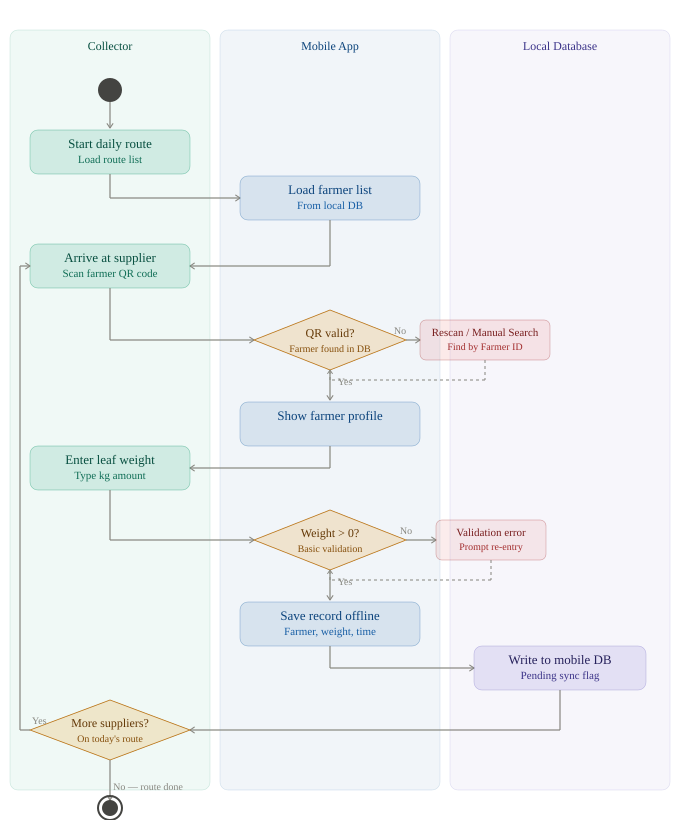
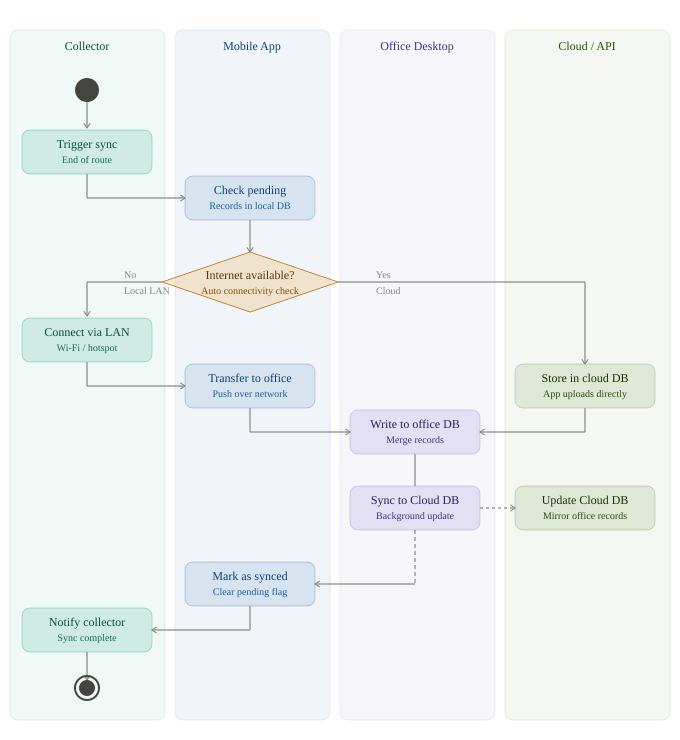
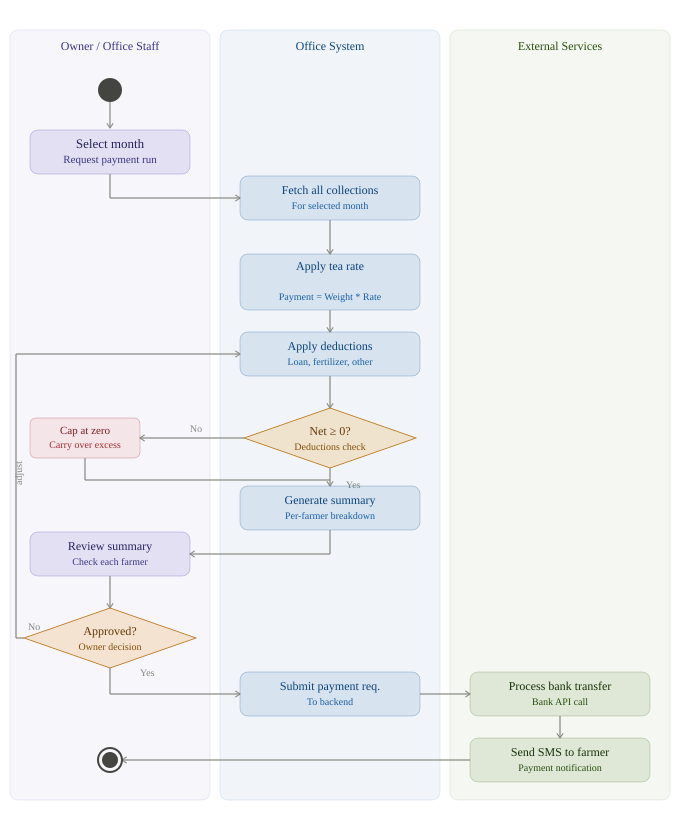
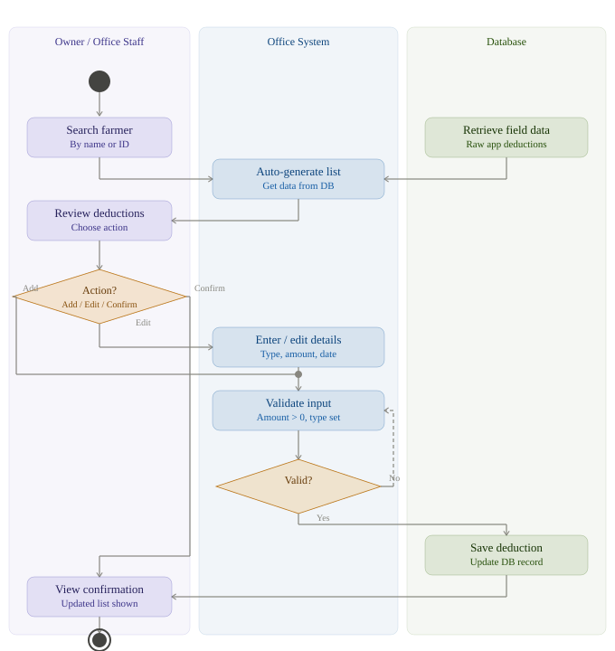
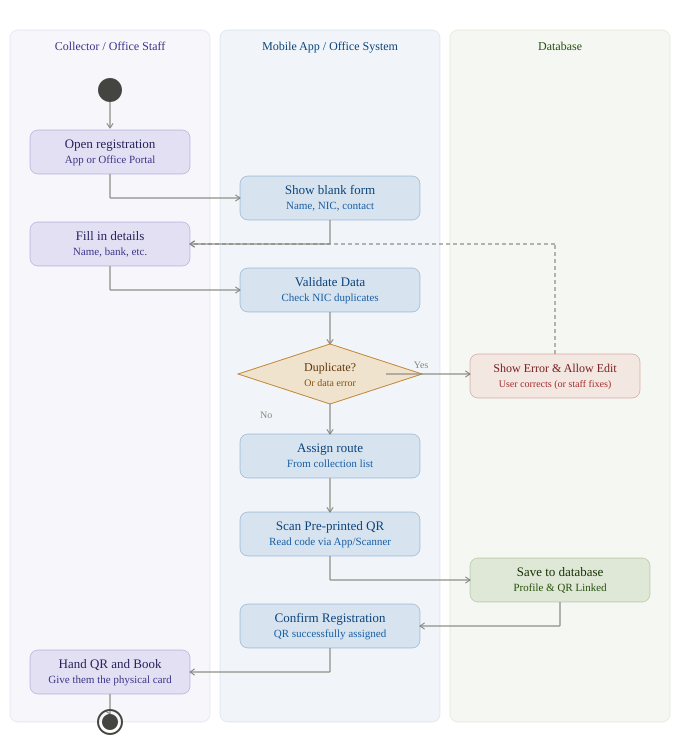

# Activity Diagrams

## Diagram 1 — Daily tea leaf collection
This diagram illustrates the daily workflow for a collector. It shows the flow from starting the daily route, scanning the farmer's QR code upon arrival, entering the tea leaf weight, saving the record offline in the mobile database, and completing the route.

## Diagram 2 — Data synchronisation (local and cloud)
This workflow details how the mobile app syncs data at the end of the day. It highlights the decision process between syncing via local LAN (office desktop) when offline, or syncing directly to the Cloud/API when internet is available.

## Diagram 3 — Monthly payment calculation and processing
This diagram outlines the end-of-month financial process. It shows how the office staff triggers the payment run, applies tea rates and deductions, handles negative net balances, and finally processes bank transfers and sends SMS notifications to the farmers upon owner approval.

## Diagram 4 — Deduction management (loans and fertilizer)
This process flow describes how office staff manage deductions. It includes reviewing auto-generated deductions submitted from the mobile app, validating data, and allowing staff to manually add, edit, or confirm deduction records (such as loans and fertilizer advances) for a farmer.

## Diagram 5 — Farmer registration and profile management
This workflow captures the onboarding process for new farmers. It illustrates the steps taken by office staff or collectors to open a registration form, validate details (like NIC), assign a collection route, link a pre-printed QR code to the profile, and hand the physical QR card to the farmer.

