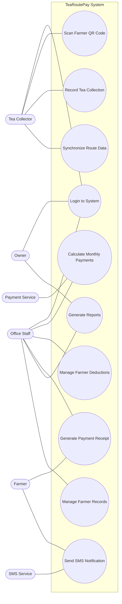

```mermaid
flowchart LR

    %% Actors
    Farmer([Farmer])
    Collector([Tea Collector])
    Office([Office Staff])
    Owner([Owner])
    SMS([SMS Service])
    Payment([Payment Service])

    %% System Boundary
    subgraph TeaRoutePay System

        UC1((Login to System))
        UC2((Scan Farmer QR Code))
        UC3((Record Tea Collection))
        UC4((Synchronize Route Data))
        UC5((Calculate Monthly Payments))
        UC6((Manage Farmer Deductions))
        UC7((Generate Payment Receipt))
        UC8((Generate Reports))
        UC9((Send SMS Notification))
        UC10((Manage Farmer Records))

    end

    %% Farmer Connections
    Farmer --- UC7
    Farmer --- UC9

    %% Tea Collector Connections
    Collector --- UC1
    Collector --- UC2
    Collector --- UC3
    Collector --- UC4

    %% Office Staff Connections
    Office --- UC1
    Office --- UC5
    Office --- UC6
    Office --- UC7
    Office --- UC8
    Office --- UC10

    %% Owner Connections
    Owner --- UC1
    Owner --- UC8

    %% External Services
    SMS --- UC9
    Payment --- UC5
```