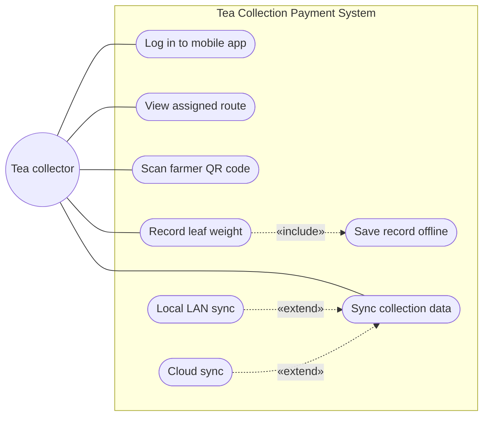
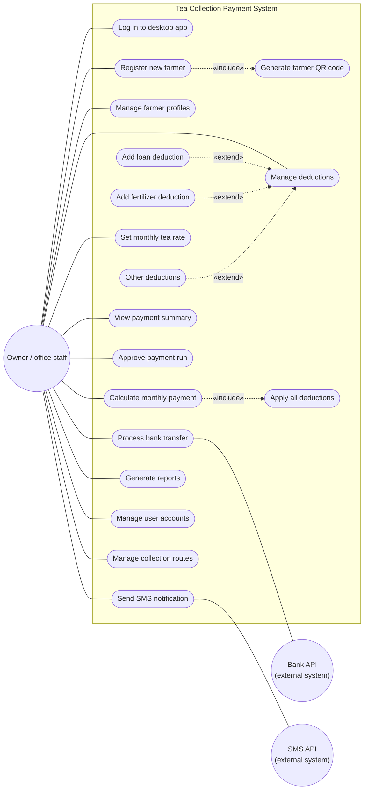
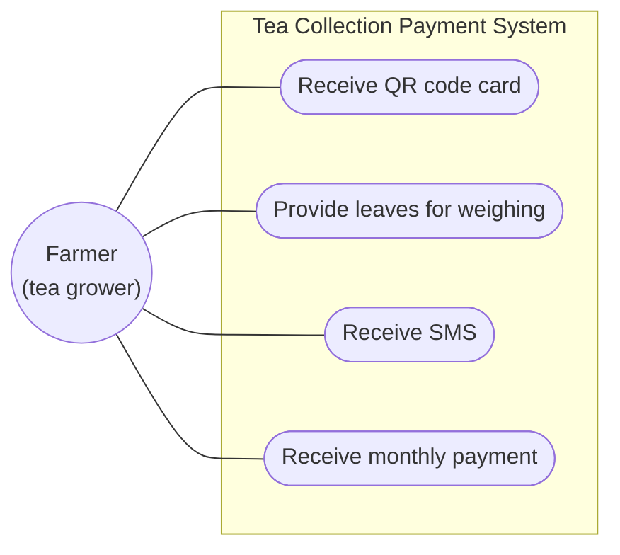

# Tea Route Pay — Use Case Diagrams

## 1. Collector Use Cases

```mermaid
flowchart LR
    %% Actor
    TeaCollector(("Tea collector"))

    %% System Boundary
    subgraph System ["Tea Collection Payment System"]
        direction TB
        UC1([Log in to mobile app])
        UC2([View assigned route])
        UC3([Scan farmer QR code])
        UC4([Record leaf weight])
        UC5([Save record offline])
        UC6([Sync collection data])
        UC7([Local LAN sync])
        UC8([Cloud sync])
        
    end

    %% Actor Relationships
    TeaCollector --- UC1
    TeaCollector --- UC2
    TeaCollector --- UC3
    TeaCollector --- UC4
    TeaCollector --- UC6

    %% Includes & Extends
    UC4 -. "«include»" .-> UC5
    UC7 -. "«extend»" .-> UC6
    UC8 -. "«extend»" .-> UC6
```

## 2. Owner / Office Staff Use Cases

```mermaid
flowchart LR
    %% Actors
    Owner(("Owner / office staff"))
    BankAPI(("Bank API\n(external system)"))
    SMSAPI(("SMS API\n(external system)"))

    %% System Boundary
    subgraph System ["Tea Collection Payment System"]
        direction TB
        UC9([Log in to desktop app])
        UC10([Register new farmer])
        UC11([Generate farmer QR code])
        UC12([Manage farmer profiles])
        UC13([Manage deductions])
        UC14([Add loan deduction])
        UC15([Add fertilizer deduction])
        UC16([Other deductions])
        UC17([Set monthly tea rate])
        UC18([Calculate monthly payment])
        UC19([Apply all deductions])
        UC20([View payment summary])
        UC21([Approve payment run])
        UC22([Process bank transfer])
        UC23([Send SMS notification])
        UC24([Generate reports])
        UC25([Manage user accounts])
        UC26([Manage collection routes])
        
    end

    %% Actor Relationships
    Owner --- UC9
    Owner --- UC10
    Owner --- UC12
    Owner --- UC13
    Owner --- UC17
    Owner --- UC18
    Owner --- UC20
    Owner --- UC21
    Owner --- UC22
    Owner --- UC23
    Owner --- UC24
    Owner --- UC25
    Owner --- UC26

    UC22 --- BankAPI
    UC23 --- SMSAPI

    %% Includes & Extends
    UC10 -. "«include»" .-> UC11
    UC18 -. "«include»" .-> UC19
    
    UC14 -. "«extend»" .-> UC13
    UC15 -. "«extend»" .-> UC13
    UC16 -. "«extend»" .-> UC13

```

## 3. Farmer Use Cases

```mermaid
flowchart LR
    %% Actor
    Farmer(("Farmer\n(tea grower)"))

    %% System Boundary
    subgraph System ["Tea Collection Payment System"]
        direction TB
        UC27([Receive QR code card])
        UC28([Provide leaves for weighing])
        UC29([Receive SMS])
        UC30([Receive monthly payment])
        
    end

    %% Actor Relationships
    Farmer --- UC27
    Farmer --- UC28
    Farmer --- UC29
    Farmer --- UC30
```
