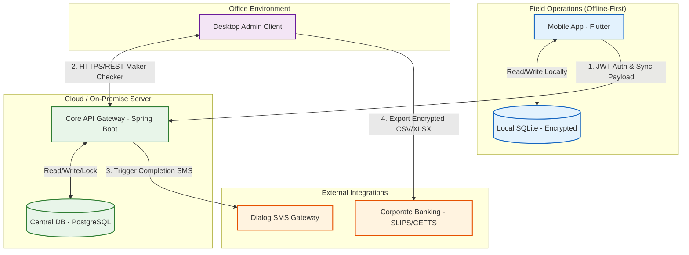

# High-Level System Architecture

## 1. Overview
The TeaRoutePay system employs a distributed, offline-first client-server architecture. It is designed to ensure uninterrupted field operations in zero-connectivity environments while maintaining strict, centralized financial integrity at the office level.

## 2. High-Level Architecture Diagram
*The following diagram illustrates the primary system components, their data flows, and external service integrations.*

## 3. Core System Components

### 3.1 Edge Node: Mobile Application (Flutter)
Deployed to field collectors, this component acts as the primary data ingestion point for daily tea weights and cash advance issuance.
* **Local Storage:** Utilizes an encrypted SQLite database to store daily routes, cached farmer QR data, and pending transactions.
* **Sync Manager:** A background queue that monitors network state and dispatches JSON payloads to the central server when connectivity is restored, ensuring the UI remains unblocked.

### 3.2 Office Node: Desktop Administration Client
Used by office staff and the business owner to execute complex financial logic.
* **Responsibilities:** Resolving sync collisions, calculating monthly gross-to-net vendor payouts, managing employee payroll, and generating business intelligence reports (P&L, Factory Sales).
* **Security:** Enforces the Maker-Checker authorization workflow at the UI level.

### 3.3 Core Server: Backend API (Java / Spring Boot)
The centralized brain of the system, exposing RESTful endpoints for both the mobile and desktop clients.
* **Idempotency Engine:** Validates incoming mobile sync payloads using composite keys (Farmer ID + Date + Collector ID) to silently discard network-induced duplicate submissions.
* **Transaction Management:** Leverages Spring Data JPA and `@Transactional` boundaries to ensure all financial calculations (deduction hierarchy, arrears carry-forward) are executed with strict ACID compliance.

### 3.4 Central Database (PostgreSQL)
The immutable ledger for the business. Stores the master records for all farmers, employees, historical collections, and locked financial batches.

## 4. Data Flow & Offline-First Behavior
To fulfill the operational requirements in low-connectivity rural areas, data flows through the system using a **Deferred Synchronization Protocol**:

1. **Local Commit (Offline):** A collector scans a QR code and enters the daily weight. The mobile app immediately writes this to the local SQLite database. The record is flagged as `PENDING`.
2. **Network Restoration:** Once a stable connection is detected, the mobile Sync Manager bundles all `PENDING` records into a JSON payload and POSTs it to the Spring Boot API over TLS 1.3.
3. **Server Validation:** The backend validates the payload against the 48-hour stale device rule and checks for idempotency. Valid records are committed to PostgreSQL.
4. **Acknowledgment:** The server returns a `200 OK`. The mobile app updates the local records to `SYNCED` and clears the queue.

## 5. External Service Integration
* **SMS Gateway:** Asynchronously triggered by the Spring Boot backend upon successful daily syncs and monthly payout approvals to notify farmers via GSM-7/UCS-2 encoded messages.
* **Banking Export:** The desktop client generates formatted corporate bank files (e.g., CSV/XLSX) based on the approved vendor payout batch, which are then manually or programmatically uploaded to the bank's portal for bulk fund clearing.
