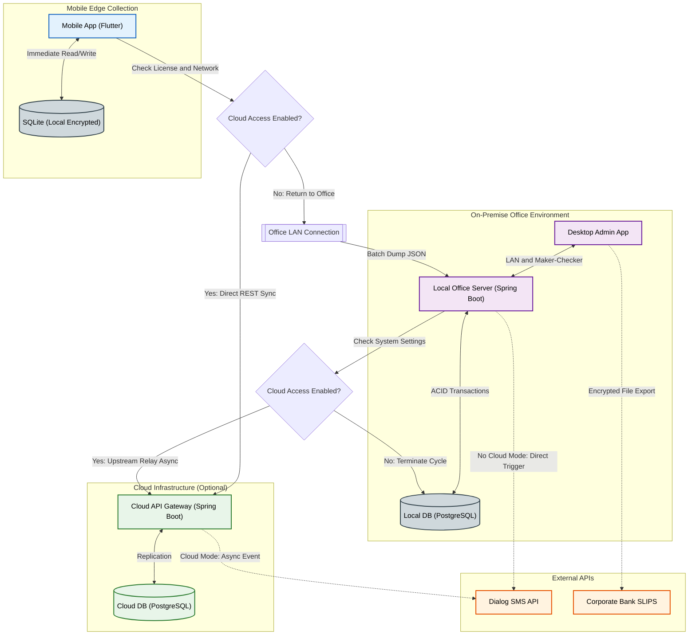

# High-Level System Architecture Specification

## 1. Architectural Overview
The TeaRoutePay system utilizes an adaptive **Hybrid Local-First / Cloud-Enabled Architecture** built upon a distributed modular monolith pattern. It dynamically scales its data synchronization and network topology based on a system feature flag (`cloudAccessEnabled`). 

It guarantees uninterrupted field operations in zero-connectivity environments, maintains strict financial integrity via Dual Control, and operates in two distinct states:
1. **Local-Only Standalone Mode:** For completely air-gapped business environments, relying entirely on on-premise Local Area Networking (LAN).
2. **Cloud-Hybrid Synchronization Mode:** For setups requiring continuous cloud durability, offsite backups, and remote ownership access.

---

## 2. High-Level Architecture Diagram
*The following diagram models the adaptive data routing pathways dictated by the license configuration flag, active network connectivity, and security protocols.*

---

## 3. Core System Components

### 3.1 Edge Node: Mobile Application (Flutter)
Acts as the field data ingestion component. It dynamically changes its data sync strategy based on the system profile.
* **Encrypted Edge Storage:** Utilizes SQLCipher (SQLite) to encrypt all locally cached farmer PII and daily transactions.
* **Adaptive Sync Manager:**
    * If `cloudAccessEnabled == true` and an internet connection is detected, it pushes records directly to the Cloud Backend.
    * If `cloudAccessEnabled == false` or the device is completely offline, it queues records for a localized **Office LAN Dump** when the collector returns to base, ensuring the UI remains unblocked.

### 3.2 Office Node: On-Premise Server & Desktop Client
The local nerve center of the tea route operation, ensuring zero business down-time if regional ISP grids fail.
* **Desktop Admin Client:** Dynamically restricts access to Payroll, P&L, and Factory Sales modules. **Enforces Maker-Checker rules**, physically disabling approval buttons for any batch where the logged-in user matches the batch creator.
* **Local Office Server (Spring Boot):** Exposes LAN REST endpoints. Leverages Spring Data JPA and `@Transactional` boundaries to ensure all gross-to-net financial calculations are executed with strict ACID compliance.
* **On-Premise Database (PostgreSQL):** The primary operational ledger, functioning as the permanent database for local-only clients, or as an asynchronous staging area for hybrid clients.

### 3.3 Cloud Node: Infrastructure Layer (Spring Boot + PostgreSQL)
An optional, highly scalable extension layer.
* **Upstream Synchronization Engine:** Listens for sync payloads forwarded from field devices directly or mirrored upstream from local office servers.
* **Cloud Database:** Aggregates records for decentralized report viewing, multi-location business monitoring, and automated disaster recovery.

---

## 4. Adaptive Deferred Synchronization Mechanics
Data flows through the system using a robust **Deferred Synchronization Protocol** governed by runtime validation logic:

1. **Local Edge Commit:** A collector enters a daily weight. The Flutter app immediately commits this to the encrypted SQLite DB with a `PENDING` flag.
2. **Scenario A: Local-Only Ingestion (`cloudAccess == false`):** * The collector physically returns to the office and connects to the secure Wi-Fi router.
    * The mobile app connects to the on-premise Spring Boot server and flushes its cache.
    * Data is processed, committed to the local PostgreSQL DB, and marked `SYNCED` on the mobile device. No external internet hits are initiated.
3. **Scenario B: Cloud-Hybrid Synchronization (`cloudAccess == true`):**
    * **Real-time Push:** With active 4G, data bypasses the local office server entirely, updating the cloud database instantly.
    * **Delayed Relay:** If data was cached offline, it dumps into the local office database upon arrival. The local Spring Boot server recognizes the active flag and securely mirrors the delta transactions to the cloud instance over TLS 1.3 via a background thread.

---

## 5. System Robustness, Security & Integrations
* **Idempotency Guardrails:** Both local and cloud backend layers feature matching composite keys `(FarmerID + CollectionDate + CollectorID + Timestamp)`. If a mobile device accidentally dumps data into both the cloud and the local server, the system silently discards the duplicate to prevent financial corruption.
* **Feature Flag Immutability:** The `cloudAccessEnabled` property is verified through a cryptographically signed license payload key and cannot be altered locally.
* **External SMS Gateway:** Asynchronously triggered upon successful daily syncs and monthly approvals. Operates on a circuit-breaker pattern—offloaded to cloud workers in hybrid mode, or handled directly by the local server in LAN mode.
* **Banking Export:** The desktop client generates immutable, formatted corporate bank files (CSV/XLSX) based on the approved Maker-Checker payout batch for bulk SLIPS/CEFTS clearing.
